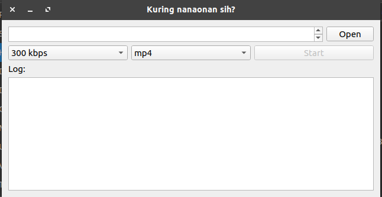

# Video Converter

Small and lightweight video converter made with QT5 and C++. Open Source

To compile: 

1. Download g++ and qt libraries.

```bash
sudo apt install build-essential qt5-default qt5-qmake ffmpeg -y
```

For Ubuntu 21.04 and later

```bash
sudo apt install build-essential qtbase5-dev qtchooser qt5-qmake qtbase5-dev-tools ffmpeg -y
```


2. Run command

```bash
qmake QT_Temp.pro
make
```

3. Run the application

```bash
./app
```


See TODO.md to contribute.
